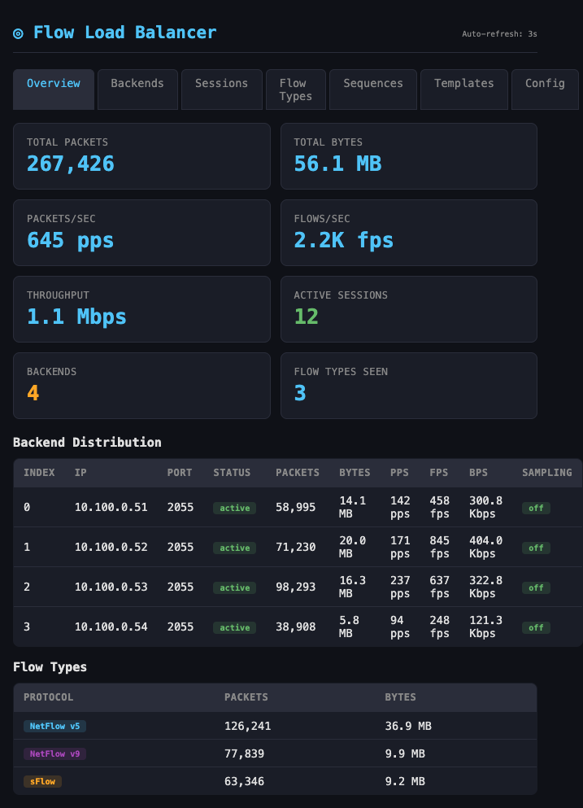
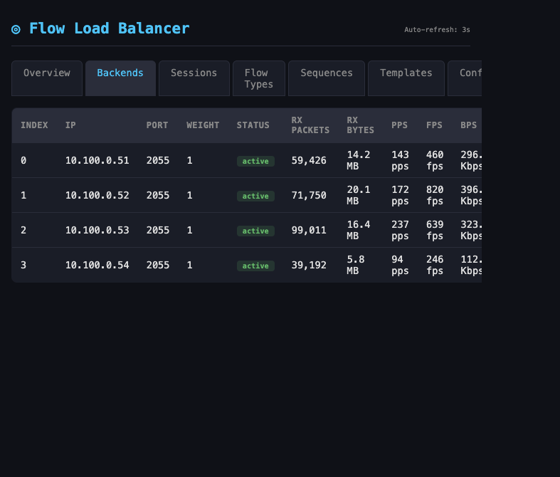
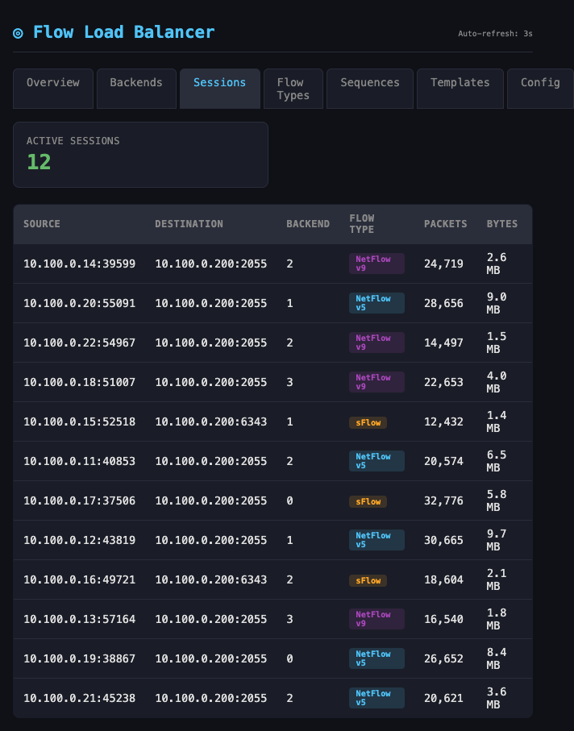
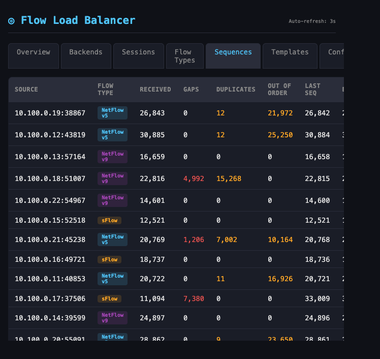
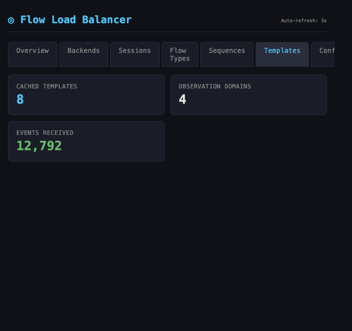

# fload-balancer

High-performance XDP/eBPF load balancer for NetFlow v5/v9, IPFIX, and sFlow traffic.

# Reasoning
The reason for creating this is that flow has some unique challenges that aren't easily addressed with standard load balancers. some of the things this addresses:
- Flow collectors generally care more about "flows per second" than packets per second. This allows you to choose either.
- This load balancer has the ability to intelligently rebalance when a collector hits certain thresholds.
- Rebalances in a way that avoids a "thundering herd" problem.
- Although, not ideal, this can gracefully degrade if the backend targets get more than the allocated flow by sampling packets. It does NOT add sample rates to individual flows.
- Auto discovery of flow type (sFlow, Netflow, IPFIX) allows flow statistics tracking based on the protocol. 
- If a flow moves from one collector to the other, a template must be sent for the ne collector to decode the flow. This can aintain a template cache and can send new templates on demand. this allows for seemless transitions without the backend pool having to share tempalate information.
- Flow sequence number tracking allows users to understnd if flow data is being lost before getting to the collector. 
- Allows configuration chages without restarting. this minimizes downtime.
- Load balancers tend to need periodic "flushes", this is not always good for UDP. this allows for sessions to age out.
- gRPC API so it can be managed as a service
- XDP eBPF for packet handling/load balancing. This completly bypasses the kernel networking stack, allowing for wire-speed
- Dataplane is all in-kernel eBPF (eBPF C code). Control plane is userspace, written in Go. eBPF maps are used to share information

## Table of Contents

- [Architecture](#architecture)
- [Features](#features)
- [Requirements](#requirements)
- [Quick Start](#quick-start)
- [Building](#building)
- [Deployment](#deployment)
  - [Bare Metal / systemd](#bare-metal--systemd)
  - [Docker](#docker)
- [Configuration Reference](#configuration-reference)
- [CLI Reference (`lbctl`)](#cli-reference-lbctl)
- [Web Dashboard](#web-dashboard)
- [gRPC API](#grpc-api)
- [How It Works](#how-it-works)
  - [XDP Data Plane](#xdp-data-plane)
  - [Flow Type Detection](#flow-type-detection)
  - [Session Persistence](#session-persistence)
  - [Sequence Number Tracking](#sequence-number-tracking)
  - [Template Cache & Replay](#template-cache--replay)
  - [Auto-Rebalancing & Sampling](#auto-rebalancing--sampling)
  - [Health Checking](#health-checking)
- [BPF Maps](#bpf-maps)
- [Observability](#observability)
- [Testing & Benchmarks](#testing--benchmarks)
- [Project Structure](#project-structure)
- [License](#license)

---

## Architecture

```
                        ┌─────────────────────────────────┐
                        │           XDP (kernel)           │
  NetFlow/IPFIX/sFlow   │  ┌─────────────────────────────┐│    ┌────────────┐
  UDP packets ─────────►│  │  Parse ETH/IP/UDP           ││───►│ Backend #0 │
                        │  │  Session lookup (5-tuple)    ││    └────────────┘
                        │  │  Flow type identification    ││    ┌────────────┐
                        │  │  Sequence tracking           ││───►│ Backend #1 │
                        │  │  Template detection → perf   ││    └────────────┘
                        │  │  Sampling (1-in-N)           ││    ┌────────────┐
                        │  │  DNAT + FIB forward          ││───►│ Backend #N │
                        │  └─────────────────────────────┘│    └────────────┘
                        │         BPF Maps + Perf Ring     │
                        └──────────┬───────────────────────┘
                                   │
                        ┌──────────▼───────────────────────┐
                        │       Go Userspace                │
                        │  ┌──────────┐  ┌───────────────┐ │
                        │  │ gRPC API │  │ Health Checker │ │
                        │  └──────────┘  └───────────────┘ │
                        │  ┌──────────┐  ┌───────────────┐ │
                        │  │  Web UI  │  │  Rebalancer   │ │
                        │  └──────────┘  └───────────────┘ │
                        │  ┌──────────────────────────────┐│
                        │  │ Metrics · Sessions · Template ││
                        │  │ Collector  Cleanup    Cache   ││
                        │  └──────────────────────────────┘│
                        └──────────────────────────────────┘
```

## Features

| Category | Feature | Description |
|----------|---------|-------------|
| **Data Plane** | XDP fast path | Packet processing at driver level, before the kernel network stack |
| | Session persistence | 5-tuple hash-based session affinity via BPF hash maps |
| | Flow identification | Auto-detects NetFlow v5/v9, IPFIX, sFlow from UDP payload bytes |
| | Flow counting | Extracts per-packet flow record count for FPS (flows/sec) tracking; falls back to PPS for unknown types |
| | Sequence tracking | Detects gaps, duplicates, and out-of-order packets per source |
| | Packet sampling | Configurable 1-in-N sampling per backend (set from userspace) |
| | Template detection | Identifies v9/IPFIX template packets in the XDP path; always forwarded (never sampled) |
| **Control Plane** | Auto-rebalancing | Distributes sessions across backends when PPS or FPS thresholds are breached (anti-thundering-herd) |
| | Template cache & replay | Caches v9/IPFIX templates; replays them to new collectors on failover |
| | Health checking | TCP probe per backend with configurable interval, timeout, and retries |
| | Session cleanup | Automatic expiration of idle sessions based on configurable timeout |
| **Management** | gRPC API | 10 RPCs for backend CRUD, sessions, metrics, and config management |
| | CLI (`lbctl`) | Command-line client for all gRPC operations |
| | Web dashboard | Embedded dark-themed SPA with 7 tabs (Overview, Backends, Sessions, Flow Types, Sequences, Templates, Config) |
| **Operations** | Docker support | Multi-stage Dockerfile with full code generation |
| | systemd unit | Hardened service file with capabilities, ProtectSystem, PrivateTmp |
| | Structured logging | JSON-format logs via `slog` to stdout/journal |

## Requirements

| Component | Minimum Version |
|-----------|----------------|
| Linux kernel | ≥ 5.10 (XDP, BPF bounded loops, `bpf_fib_lookup`) |
| clang / LLVM | ≥ 14 |
| libbpf-dev | matching kernel headers |
| Go | ≥ 1.23 |
| protoc | ≥ 3.x |

Runtime capabilities: `CAP_NET_ADMIN`, `CAP_BPF`, `CAP_NET_RAW`, `CAP_SYS_ADMIN`, `MEMLOCK=infinity`.

## Quick Start

```bash
# Clone and build
git clone https://github.com/fload-balancer/fload-balancer.git
cd fload-balancer
sudo apt install clang llvm libbpf-dev linux-headers-$(uname -r) protobuf-compiler
make install-deps
make all

# Configure
cp config.example.yaml config.yaml
# Edit config.yaml — set interface, vip_ip, backends

# Run (requires root for XDP attachment)
sudo ./bin/lbserver -config config.yaml

# In another terminal — check status
./bin/lbctl backends
./bin/lbctl stats
```

Open `http://localhost:8080` for the web dashboard.

## Building

### From Source

```bash
# Install system packages (Debian/Ubuntu)
sudo apt install clang llvm libbpf-dev linux-headers-$(uname -r) protobuf-compiler

# Install Go code-gen tools
make install-deps

# Generate BPF objects + protobuf, then build
make all                 # equivalent to: make generate build

# Or step by step:
make bpf                 # generate BPF Go bindings via bpf2go
make proto               # generate protobuf Go code
make build               # build bin/lbserver and bin/lbctl
```

### Makefile Targets

| Target | Description |
|--------|-------------|
| `make all` | Generate + build (default) |
| `make generate` | Run BPF and protobuf code generation |
| `make bpf` | Generate BPF Go bindings only |
| `make proto` | Generate protobuf Go code only |
| `make build` | Build both binaries to `bin/` |
| `make test` | Run all Go tests |
| `make docker` | Build Docker image |
| `make install` | Install to system via systemd (root) |
| `make uninstall` | Remove systemd install (root) |
| `make clean` | Remove build artifacts and generated code |
| `make fmt` | Format Go and C source |
| `make install-deps` | Install Go code-gen tools |

## Deployment

### Bare Metal / systemd

```bash
# Build and install (binaries, config, systemd unit)
sudo make install

# Edit config
sudo nano /etc/fload-balancer/config.yaml

# Enable and start
sudo systemctl enable --now fload-balancer

# View logs
sudo journalctl -u fload-balancer -f

# Uninstall (keeps config)
sudo make uninstall
```

The systemd unit includes security hardening:
- Runs with only required capabilities (`CAP_NET_ADMIN`, `CAP_BPF`, `CAP_NET_RAW`, `CAP_SYS_ADMIN`)
- `ProtectSystem=strict` — read-only filesystem except `/sys/fs/bpf`
- `ProtectHome=yes`, `PrivateTmp=yes`, `NoNewPrivileges=yes`
- `LimitMEMLOCK=infinity` — required for BPF map allocation
- Auto-restarts on failure with 5-second backoff

Installed files:
| Path | Description |
|------|-------------|
| `/usr/local/bin/lbserver` | Server binary |
| `/usr/local/bin/lbctl` | CLI binary |
| `/etc/fload-balancer/config.yaml` | Configuration |
| `/etc/systemd/system/fload-balancer.service` | systemd unit |

### Docker

```bash
# Build image
make docker
# or: docker build -t fload-balancer:latest .

# Run with docker compose
cp config.example.yaml config.yaml   # edit first
docker compose up -d

# View logs
docker compose logs -f

# Stop
docker compose down
```

Or run directly:

```bash
docker run -d --name fload-balancer \
    --privileged --network host \
    -v /sys/fs/bpf:/sys/fs/bpf \
    -v $(pwd)/config.yaml:/etc/fload-balancer/config.yaml:ro \
    fload-balancer:latest
```

> **Note:** XDP requires `--privileged` and `--network host`. The container cannot operate in bridge mode.

The Docker image:
- Multi-stage build — generates BPF objects and protobuf from source
- Runtime image is Debian Bookworm slim (~111 MB)
- Binaries are statically linked and stripped (`-ldflags="-s -w"`)

## Configuration Reference

Configuration is a YAML file, default path: `config.yaml` (override with `-config <path>`).

### Complete Example

```yaml
# Network interface to attach XDP program
interface: eth0

# Virtual IP that receives flow traffic
vip_ip: "10.0.0.100"

# UDP ports to load-balance
vip_ports:
  - 2055   # NetFlow v5/v9
  - 4739   # IPFIX
  - 6343   # sFlow
  - 9995   # NetFlow alternate

# Backend collectors
backends:
  - ip: "10.0.1.10"
    port: 2055       # destination port (0 = keep original)
    weight: 1         # relative weight for session assignment
    health_port: 8080 # TCP port for health checks (0 = disabled)
  - ip: "10.0.1.11"
    port: 2055
    weight: 1
    health_port: 8080

# gRPC management interface
grpc_addr: ":50051"

# Session persistence timeout (seconds)
session_timeout_sec: 300

# Flow sequence tracking
seq_tracking: true
seq_window_size: 16

# TCP health checking
health_check:
  enabled: true
  interval_sec: 10
  timeout_sec: 3
  retries: 3

# Web dashboard
web_ui:
  enabled: true
  addr: ":8080"

# Automatic rebalancing and sampling
rebalance:
  enabled: true
  assessment_interval_sec: 10
  assessment_count: 3
  threshold_pps: 50000
  threshold_fps: 0            # FPS threshold (preferred over PPS when > 0)
  sampling_threshold_pps: 100000
  sampling_threshold_fps: 0   # FPS sampling threshold (preferred over PPS when > 0)
  sampling_rate: 2
  max_sessions_to_move: 10
```

### Field Reference

#### Top-level

| Field | Type | Default | Required | Description |
|-------|------|---------|----------|-------------|
| `interface` | string | — | **yes** | Network interface to attach XDP program (e.g., `eth0`) |
| `vip_ip` | string | — | **yes** | Virtual IP address that receives flow traffic |
| `vip_ports` | list of uint16 | — | **yes** | UDP ports to intercept and load-balance |
| `backends` | list | — | **yes** | Downstream collector definitions (see below) |
| `grpc_addr` | string | `:50051` | no | gRPC management listen address |
| `session_timeout_sec` | int | `300` | no | Seconds before idle sessions are expired |
| `seq_tracking` | bool | `false` | no | Enable per-source sequence number tracking |
| `seq_window_size` | int | `16` | no | Acceptable reorder window for sequence tracking |

#### `backends[]`

| Field | Type | Default | Description |
|-------|------|---------|-------------|
| `ip` | string | — | Backend collector IP address (**required**) |
| `port` | uint16 | `0` | Destination port (0 keeps the original VIP port) |
| `weight` | uint8 | `1` | Relative weight for new session assignment |
| `health_port` | uint16 | `0` | TCP port for health checks (0 disables health checking for this backend) |

#### `health_check`

| Field | Type | Default | Description |
|-------|------|---------|-------------|
| `enabled` | bool | `false` | Enable TCP health probing |
| `interval_sec` | int | `10` | Seconds between health check rounds |
| `timeout_sec` | int | `3` | TCP connect timeout per probe |
| `retries` | int | `3` | Consecutive failed probes before marking backend down |

When a backend is marked down, its `active` flag is cleared in the BPF map and new sessions are not assigned to it. Existing sessions are automatically redistributed across remaining healthy backends using per-flow hashing to avoid thundering-herd.

#### `web_ui`

| Field | Type | Default | Description |
|-------|------|---------|-------------|
| `enabled` | bool | `false` | Enable the web dashboard and JSON API |
| `addr` | string | `:8080` | HTTP listen address |

#### `rebalance`

| Field | Type | Default | Description |
|-------|------|---------|-------------|
| `enabled` | bool | `false` | Enable automatic rebalancing |
| `assessment_interval_sec` | int | `10` | How often to sample backend rates |
| `assessment_count` | int | `3` | Consecutive breaches before taking action (prevents reacting to spikes) |
| `threshold_pps` | float | `0` | PPS per backend that triggers session rebalancing |
| `threshold_fps` | float | `0` | FPS per backend that triggers session rebalancing (preferred over PPS when > 0; falls back to PPS for flow types without a count field) |
| `sampling_threshold_pps` | float | `0` | PPS per backend that triggers packet sampling (set 0 to disable) |
| `sampling_threshold_fps` | float | `0` | FPS per backend that triggers packet sampling (preferred over PPS when > 0) |
| `sampling_rate` | int | `2` | 1-in-N sampling rate when sampling is active (2 = 50%, 4 = 25%) |
| `max_sessions_to_move` | int | `10` | Maximum sessions moved per rebalance event |

## CLI Reference (`lbctl`)

`lbctl` connects to the gRPC server to manage the load balancer at runtime.

```
Usage: lbctl [flags] <command>
```

**Flags:**

| Flag | Default | Description |
|------|---------|-------------|
| `-addr` | `localhost:50051` | gRPC server address |

**Commands:**

| Command | Description | Example |
|---------|-------------|---------|
| `backends` | List all backends with index, IP, port, active status, weight | `lbctl backends` |
| `add-backend <ip> [port]` | Add a new backend at the next available index | `lbctl add-backend 10.0.1.20 2055` |
| `remove-backend <index>` | Deactivate a backend by index | `lbctl remove-backend 3` |
| `sessions` | List all active sessions with 5-tuple, backend, flow type, counters | `lbctl sessions` |
| `flush-sessions` | Remove all session entries from the BPF map | `lbctl flush-sessions` |
| `stats` | Per-backend packet and byte counters | `lbctl stats` |
| `flow-stats` | Per-flow-type (v5/v9/IPFIX/sFlow) aggregate counters | `lbctl flow-stats` |
| `seq-stats` | Sequence tracking: gaps, duplicates, out-of-order per source | `lbctl seq-stats` |
| `config` | Show the current running configuration | `lbctl config` |

**Example output:**

```
$ lbctl stats
INDEX  IP          PACKETS    BYTES
0      10.0.1.10   1482937    593174800
1      10.0.1.11   1479201    591680400
2      10.0.1.12   1481455    592582000

$ lbctl flow-stats
FLOW_TYPE    PACKETS    BYTES
NetFlow v9   2981340    1192536000
IPFIX        1462253    584901200
```

## Web Dashboard

When `web_ui.enabled: true`, an embedded dark-themed single-page application is served at the configured address (default `:8080`).

### Screenshots

**Overview** — Live metrics, backend distribution, and flow type breakdown:



**Backends** — Per-backend detail with PPS, FPS, and sampling status:



**Sessions** — Active sessions with flow type and backend assignment:



**Sequences** — Per-source sequence tracking with gap and duplicate detection:



**Templates** — Template cache statistics for NetFlow v9/IPFIX:



### Tabs

| Tab | Content |
|-----|---------|
| **Overview** | VIP config, total PPS/FPS/BPS, backend cards with live rates, flow type breakdown |
| **Backends** | Per-backend table: IP, port, weight, active, packets, bytes, PPS, FPS, BPS, sampling rate |
| **Sessions** | Active session table: source, destination, backend, flow type, counters |
| **Flow Types** | Aggregate statistics per protocol type |
| **Sequences** | Per-source sequence tracking: expected next, last seen, gaps, duplicates, out-of-order |
| **Templates** | Template cache statistics: total templates, observation domains, events received |
| **Config** | Current running configuration summary |

### JSON API Endpoints

All endpoints return `Content-Type: application/json`.

| Method | Path | Description |
|--------|------|-------------|
| GET | `/api/overview` | Full snapshot: config, backends with rates, flow types, totals |
| GET | `/api/backends` | Backend list with stats and sampling rates |
| GET | `/api/sessions` | Active sessions |
| GET | `/api/flow-stats` | Per-flow-type counters |
| GET | `/api/seq-stats` | Sequence tracking statistics |
| GET | `/api/template-stats` | Template cache statistics |

## gRPC API

The API is defined in `api/v1/lb.proto`. The service `LoadBalancerService` exposes 10 RPCs:

| RPC | Description |
|-----|-------------|
| `AddBackend` | Add a new backend (IP, port, weight) |
| `RemoveBackend` | Remove a backend by index |
| `ListBackends` | List all backends with status |
| `GetSessions` | Get all active sessions |
| `FlushSessions` | Remove all sessions |
| `GetBackendStats` | Per-backend packet/byte counters |
| `GetFlowTypeStats` | Per-flow-type counters |
| `GetSequenceStats` | Per-source sequence tracking |
| `GetConfig` | Get current configuration |
| `UpdateConfig` | Update configuration at runtime |

Connect with any gRPC client or use `lbctl`.

## How It Works

### XDP Data Plane

The XDP program (`bpf/xdp_lb.c`) runs at the earliest point in the Linux network stack — before `sk_buff` allocation. For each incoming packet it:

1. **Parses** Ethernet → IPv4 → UDP headers
2. **Checks** destination IP matches the VIP and destination port is in the `vip_ports` set
3. **Looks up** the 5-tuple (src_ip, dst_ip, src_port, dst_port, proto) in the session table
4. If **no session exists**: hashes the 5-tuple, assigns a backend based on `hash % num_backends`, creates a session entry
5. **Identifies** the flow type from the UDP payload (see below)
6. **Tracks** sequence numbers if enabled
7. **Detects** template-bearing packets (v9/IPFIX) and sends metadata + packet via perf ring to userspace
8. **Applies** sampling: if a sampling rate is set for the backend, drops `(N-1)/N` packets (templates are always forwarded)
9. **Rewrites** the destination IP/port (DNAT) to the assigned backend
10. Uses `bpf_fib_lookup` to resolve the next-hop MAC address and **redirects** the packet via `XDP_REDIRECT`

All per-backend and per-flow-type counters use **per-CPU arrays** for lock-free, cache-line-friendly updates.

### Flow Type Detection

Detection is automatic from the first bytes of the UDP payload — no port-based assumptions:

| Protocol | Detection Rule |
|----------|---------------|
| NetFlow v5 | Bytes 0–1 = `0x0005` (16-bit version) |
| NetFlow v9 | Bytes 0–1 = `0x0009` (16-bit version) |
| IPFIX | Bytes 0–1 = `0x000A` (16-bit version = 10) |
| sFlow v5 | Bytes 0–3 = `0x00000005` (32-bit version) |

### Session Persistence

Sessions are stored in a BPF hash map keyed by the **5-tuple** (src_ip, dst_ip, src_port, dst_port, protocol). Each session entry tracks:

- Assigned backend index
- Detected flow type
- Packet and byte counters
- Last-seen timestamp (kernel nanoseconds)

Session assignment for new flows uses `hash(5-tuple) % num_active_backends`. All subsequent packets from the same source are forwarded to the same backend — ensuring flow records from a single exporter always reach the same collector.

Idle sessions are cleaned up by a userspace goroutine at half the configured `session_timeout_sec` interval.

### Sequence Number Tracking

When `seq_tracking: true`, the XDP program extracts sequence numbers and maintains per-source state:

| Protocol | Sequence Field | Increment Per Packet |
|----------|---------------|---------------------|
| NetFlow v5 | Byte offset 16 (`flow_sequence`) | `count` field (flows in packet) |
| NetFlow v9 | Byte offset 12 (`package_sequence`) | 1 per export packet |
| IPFIX | Byte offset 8 (`sequence_number`) | 1 per SCTP/TCP/UDP message |
| sFlow v5 | Byte offset 16 (IPv4 agent) or 28 (IPv6 agent) | 1 per datagram |

The tracker uses a configurable window (`seq_window_size`, default 16) to distinguish late arrivals from actual gaps. It reports:

- **Expected next** — the sequence number we expect
- **Last seen** — the most recent sequence number received
- **Total received** — total packets processed
- **Gaps** — missing sequence numbers (lost packets)
- **Duplicates** — sequence numbers seen more than once
- **Out-of-order** — packets within the window but not in order

### Template Cache & Replay

NetFlow v9 and IPFIX use **templates** to define the structure of data records. Collectors cannot decode data records without the corresponding template. When a failover or rebalance moves sessions to a new backend, that collector may lack the templates.

**How it works:**

1. The XDP program scans v9/IPFIX packets for template flowsets (flowset ID 0/1 for v9; set ID 2/3 for IPFIX)
2. Template-bearing packets are copied to userspace via a **perf ring buffer** (`template_events` map)
3. The Go `templatecache` package parses templates and stores them keyed by `(source_ip, observation_domain, template_id)`
4. Both **regular templates** and **options templates** are cached, including IPFIX enterprise fields
5. When the rebalancer moves sessions, it calls `ReplayTemplates()` which:
   - Builds a synthetic v9 or IPFIX packet containing all cached templates for each affected observation domain
   - Sends it via a **raw socket with IP_HDRINCL**, spoofing the original device's source IP
   - The new collector receives what appears to be a normal template packet from the original device

Template packets are **never sampled** — even when packet sampling is active, templates always pass through.

### Auto-Rebalancing & Sampling

The rebalancer runs as a userspace goroutine that periodically assesses per-backend rates (FPS when `threshold_fps > 0`, otherwise PPS).

**Two-phase approach:**

1. **Session rebalancing** (Phase 1):
   - Every `assessment_interval_sec`, check each backend's FPS rate (falls back to PPS when FPS thresholds are not configured or for flow types without a count field like IPFIX)
   - If a backend exceeds the threshold for `assessment_count` consecutive assessments, move up to `max_sessions_to_move` sessions **distributed round-robin across all remaining backends** sorted by load (least-loaded first) to avoid thundering-herd on a single target
   - After moving sessions, replay templates to each target backend for the affected source IPs

2. **Packet sampling** (Phase 2):
   - If a backend still exceeds `sampling_threshold_fps` (or `sampling_threshold_pps`) after rebalancing, enable 1-in-N packet sampling for that backend
   - When load drops below the threshold, sampling is automatically disabled

The `assessment_count` requirement prevents reacting to transient traffic spikes.

#### Flow Count Extraction

The BPF program extracts the number of flow records per packet to compute FPS:

| Protocol | Count Source | Typical Range |
|----------|-------------|---------------|
| NetFlow v5 | Header bytes 2-3 (`count` field) | 1–30 |
| NetFlow v9 | Header bytes 2-3 (`count` field) | 1+ |
| IPFIX | No count in header — falls back to 1 (PPS) | — |
| sFlow v5 | `num_samples` field (offset 24 IPv4 / 36 IPv6 agent) | 1+ |
| Unknown | Falls back to 1 (PPS equivalent) | — |

### Health Checking

When `health_check.enabled: true`, a background goroutine performs **TCP connect probes** against each backend's `health_port`:

- Probes run every `interval_sec` seconds
- Each probe has a `timeout_sec` TCP connect timeout
- A backend is marked **down** after `retries` consecutive failures
- When a backend is marked down, its `active` flag is cleared in the BPF map — **new** sessions will not be assigned to it
- **Existing sessions** are redistributed across remaining healthy backends using a per-flow secondary hash (not all to the same successor), preventing thundering-herd
- When the backend recovers, the flag is restored and it begins receiving new sessions

Backends without a `health_port` (set to 0) are always considered active.

## BPF Maps

| Map | Type | Key | Value | Max Entries | Description |
|-----|------|-----|-------|-------------|-------------|
| `config_map` | Array | u32 (index 0) | `lb_config` | 1 | Global configuration |
| `vip_ports` | Hash | u16 (port, NBO) | u8 | 64 | Ports to intercept |
| `backends` | Array | u32 (index) | `backend` | 64 | Backend server entries |
| `sessions` | Hash | `five_tuple` | `session` | 65,536 | Session affinity table |
| `backend_stats` | Per-CPU Array | u32 (index) | `be_stats` | 64 | Per-backend counters (packets, bytes, flows) |
| `flow_type_stats` | Per-CPU Array | u32 (type) | `ft_stats` | 5 | Per-flow-type counters |
| `seq_track` | Hash | `five_tuple` | `seq_state` | 65,536 | Sequence tracking state |
| `sampling_rate` | Array | u32 (index) | u32 (rate) | 64 | Per-backend sampling rates |
| `template_events` | Perf Event Array | — | `template_event` + packet | per-CPU | Template packets to userspace |

## Observability

### Structured Logging

All components log JSON to stdout via Go's `slog`:

```json
{"time":"2026-04-15T10:30:00Z","level":"INFO","msg":"config loaded","interface":"eth0","vip":"10.0.0.100","ports":[2055,4739],"backends":3}
{"time":"2026-04-15T10:30:00Z","level":"INFO","msg":"XDP program attached","interface":"eth0","ifindex":2}
{"time":"2026-04-15T10:30:00Z","level":"WARN","msg":"rebalancing: backend overloaded","from_backend":0,"targets":2,"pps":62341,"threshold_pps":50000}
```

When running under systemd, logs are captured by the journal:

```bash
sudo journalctl -u fload-balancer -f         # follow logs
sudo journalctl -u fload-balancer --since -1h # last hour
sudo journalctl -u fload-balancer -p warning  # warnings and errors only
```

### Metrics Sources

| Source | Access | Update Frequency |
|--------|--------|-----------------|
| Per-backend PPS/FPS/BPS | Web UI, JSON API | Every 5 seconds (collector interval) |
| Per-flow-type counters | Web UI, JSON API, CLI | Every 5 seconds |
| Session table | Web UI, JSON API, CLI | Real-time (BPF map read) |
| Sequence tracking | Web UI, JSON API, CLI | Real-time (BPF map read) |
| Template cache stats | Web UI, JSON API | Real-time |
| Health check status | BPF map (active flag) | Every `health_check.interval_sec` |

## Testing & Benchmarks

```bash
# Run all tests (57 tests across 5 packages)
go test ./internal/... -v

# Run benchmarks
go test ./internal/... -bench=. -benchmem -run=^$
```

Key benchmark results (i7-12700K):

| Operation | ns/op | Throughput |
|-----------|------:|-----------|
| NFv9 template parse | 261 | ~3.8M ops/sec |
| IPFIX template parse | 300 | ~3.3M ops/sec |
| Template packet build | 585 | ~1.7M ops/sec |
| Template lookup | 148 | ~6.7M ops/sec |
| IP conversion | 2.9 | ~340M ops/sec |
| Config validate | 1.7 | ~594M ops/sec |

See [BENCHMARKS.md](BENCHMARKS.md) for full results.

## Project Structure

```
fload-balancer/
├── api/v1/
│   └── lb.proto                 # gRPC service definition
├── bpf/
│   └── xdp_lb.c                # XDP/eBPF C program (~600 lines)
├── cmd/
│   ├── lbserver/main.go         # Server entry point
│   └── lbctl/main.go            # CLI client
├── deploy/
│   ├── fload-balancer.service   # systemd unit
│   └── install.sh               # Install/uninstall script
├── internal/
│   ├── config/                  # YAML config loading + validation
│   ├── ebpf/                    # BPF loader, map helpers, code-gen
│   ├── health/                  # TCP health checker
│   ├── metrics/                 # Periodic BPF map reader + rate calculation
│   ├── rebalancer/              # Auto-rebalancing + sampling control
│   ├── server/                  # gRPC service implementation
│   ├── templatecache/           # v9/IPFIX template cache + raw socket sender
│   └── webui/                   # HTTP handler + embedded SPA
├── Dockerfile                   # Multi-stage Docker build
├── docker-compose.yaml          # Docker Compose for quick deployment
├── Makefile                     # Build, test, deploy targets
├── config.example.yaml          # Annotated example configuration
├── BENCHMARKS.md                # Performance benchmark results
└── README.md                    # This file
```
# Caveats

This requires the collector to have an accessible TCP port. This provides a relible way to check the status of the collector process. ICMP Port Unreachable messages could work, but they are not guarenteed 

## License

MIT
